# Projeto de Interface

A interface do Deskly apresenta as principais funcionalidades do sistema por meio de telas organizadas e intuitivas, permitindo que usuários realizem reservas, consultem disponibilidade e gerenciem informações de forma eficiente.

As interfaces foram desenvolvidas com base nos requisitos funcionais e não funcionais, além das histórias de usuário, garantindo usabilidade, desempenho e clareza na navegação.

## User Flow

Fluxo de usuário é uma técnica que permite mapear o caminho percorrido pelo usuário dentro do sistema, representando suas interações desde o acesso até a execução de ações.

O fluxo de usuário do Deskly representa os caminhos desde o login até a execução das principais ações do sistema, como consultas, reservas e gerenciamento.

Após o acesso, o usuário navega entre as funcionalidades disponíveis de forma direta. Já os administradores possuem acessos adicionais para controle de salas, usuários e reservas. O fluxo foi estruturado para evitar etapas desnecessárias e tornar a navegação mais objetiva.

## Wireframes

Os wireframes são protótipos utilizados para representar a estrutura das telas e a organização dos elementos da interface, como menus, botões e campos de informação.

No Deskly, eles foram utilizados para definir o layout e a relação entre as páginas, garantindo que cada funcionalidade do sistema esteja bem posicionada e alinhada aos requisitos funcionais definidos na documentação do projeto.

## Tela de Login

(Resumo sobre a tela)

## Tela Inicial (Dashboard)

A tela inicial apresenta um menu lateral com acesso às principais funcionalidades do sistema, como calendário, salas de reunião, estações de trabalho e reservas. No topo, há uma barra de navegação com informações do usuário, saudação personalizada, data atual e notificações. A área central exibe um resumo com dados importantes, como quantidade de salas disponíveis, estações livres, número de reservas do dia e membros cadastrados, além da listagem das reservas do usuário com opções de visualizar convidados, editar ou cancelar. Também há ações rápidas para criação de novas reservas.

Nesta tela, são apresentados os seguintes requisitos:
- RF-04: Visualizar e agendar espaços disponíveis por data e horário
- RF-05: Visualizar rapidamente suas reservas
- RF-09: Visualizar a lista de convidados
- RNF-11: Realizar uma reserva em baseado na quantidade máxima disponível na sala

### Modal - Tela Inicial (Dashboard)

O modal permite ao usuário realizar uma nova reserva de forma rápida e direta. Nele, o usuário pode selecionar o tipo de espaço (sala de reunião ou estação de trabalho), definir a data e o horário desejado e confirmar a ação, reduzindo a quantidade de etapas necessárias para o agendamento e atendendo ao requisito de usabilidade.

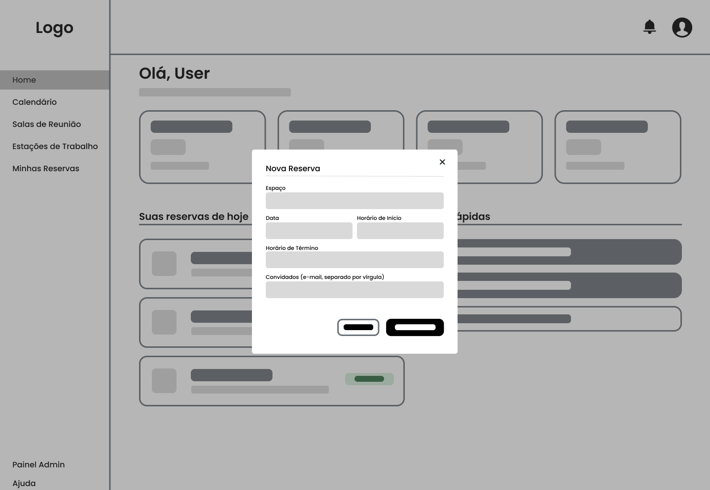

## Tela de Calendário

A tela de calendário permite ao usuário visualizar a disponibilidade dos espaços ao longo dos dias e horários. A interface apresenta um calendário interativo com navegação entre meses, exibindo reservas de salas e estações em horários específicos. O usuário pode identificar facilmente períodos livres e ocupados, além de iniciar reservas diretamente a partir da visualização.

Nesta tela, são apresentados os seguintes requisitos:
- RF-04: Visualizar e agendar espaços disponíveis por data e horário
- RF-07: Visualizar detalhes das salas (capacidade, recursos e status)
- RNF-11: Realizar uma reserva em no máximo 5 passos

### Modais - Tela de Calendário

Os modais do calendário permitem ao usuário visualizar os detalhes de uma reserva ao selecionar um evento, incluindo espaço, data e horário. Também possibilitam iniciar uma nova reserva com base no horário selecionado no calendário, mantendo a continuidade da navegação e reduzindo o número de etapas do processo.

  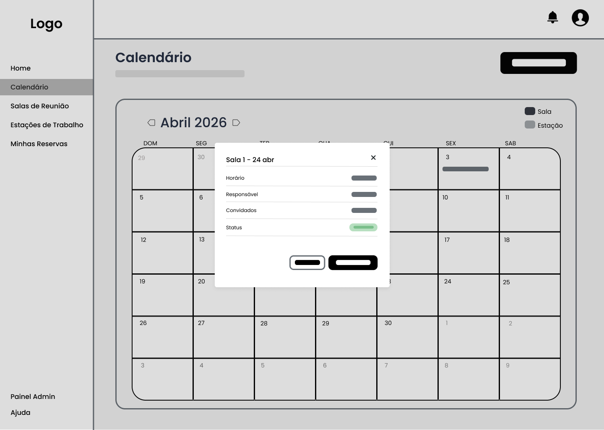
  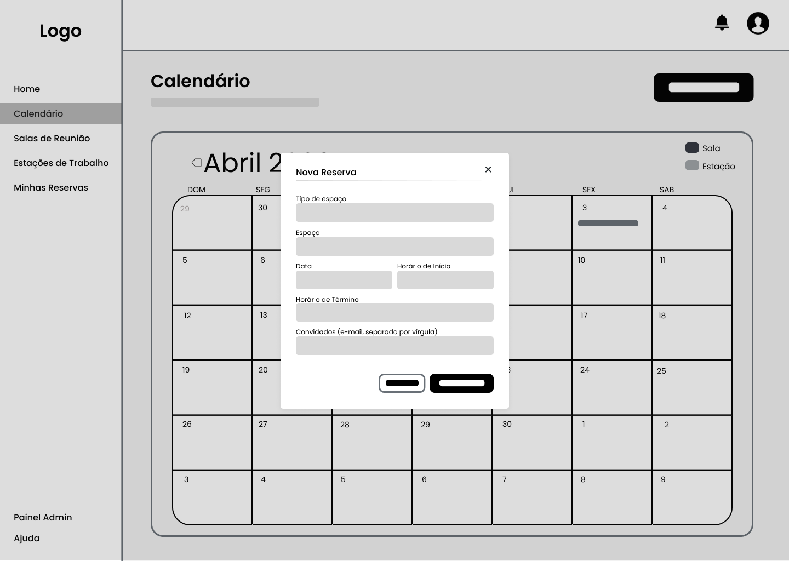

## Tela de Salas de Reunião

A tela de salas de reunião apresenta um menu lateral para navegação e filtros no topo, permitindo selecionar data, horário e capacidade desejada. A área central exibe a lista de salas com informações como nome, capacidade, recursos disponíveis e status. O usuário pode visualizar rapidamente as opções disponíveis e iniciar uma reserva.

Nesta tela, são apresentados os seguintes requisitos:
- RF-01: Cadastrar, editar e desativar salas (visão administrativa)
- RF-04: Visualizar e agendar salas disponíveis
- RF-07: Visualizar detalhes das salas
- RF-08: Adicionar convidados a uma reserva

### Modais - Tela de Salas de Reunião

Por meio dos modais, o usuário pode visualizar informações detalhadas da sala, incluindo recursos, capacidade e horários disponíveis. Também é possível realizar reservas informando data, horário e convidados, com validação automática conforme a capacidade da sala, evitando conflitos e superlotação.

  
  

## Tela de Estações de Trabalho

A tela de estações de trabalho permite ao usuário visualizar e reservar espaços individuais disponíveis. A interface apresenta uma lista organizada com identificação das mesas, localização e status.

Nesta tela, são apresentados os seguintes requisitos:
- RF-04: Visualizar e agendar estações de trabalho
- RF-01: Gerenciar estações (visão administrativa)

### Modal - Tela de Estações de Trabalho

O modal permite visualizar os detalhes da estação selecionada e realizar a reserva informando data e horário. Também pode ser utilizado para confirmação da ação, garantindo segurança e clareza no processo.

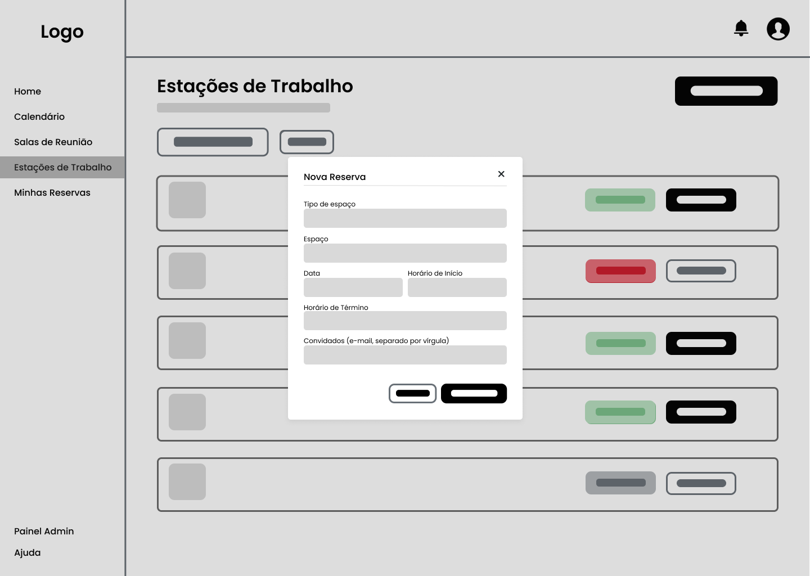

## Tela de Minhas Reservas

A tela de minhas reservas apresenta ao usuário a lista de reservas realizadas, organizadas entre reservas futuras e histórico. A interface permite visualizar informações completas e realizar ações de edição ou cancelamento.

Nesta tela, são apresentados os seguintes requisitos:
- RF-05: Visualizar, editar e cancelar reservas
- RF-09: Visualizar lista de convidados
- RNF-03: Garantir a integridade dos dados de reservas

### Modais - Tela de Minhas Reservas

Os modais permitem visualizar os detalhes completos da reserva e a lista de convidados, além de editar informações como data e horário e confirmar o cancelamento. Também são utilizados para confirmação de ações, evitando alterações indevidas e garantindo consistência dos dados.

  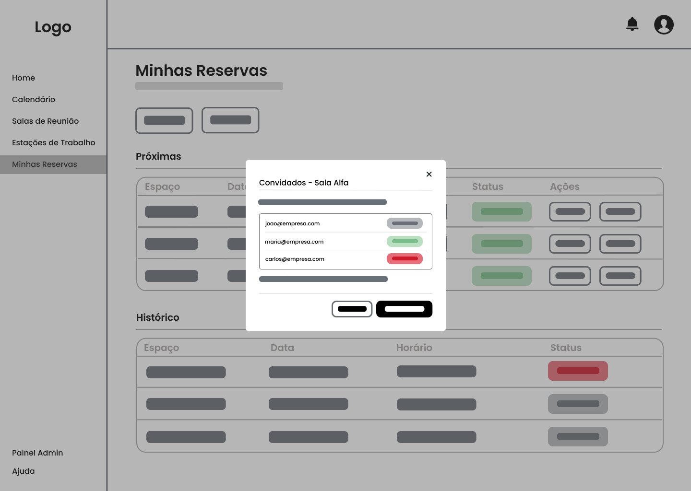
  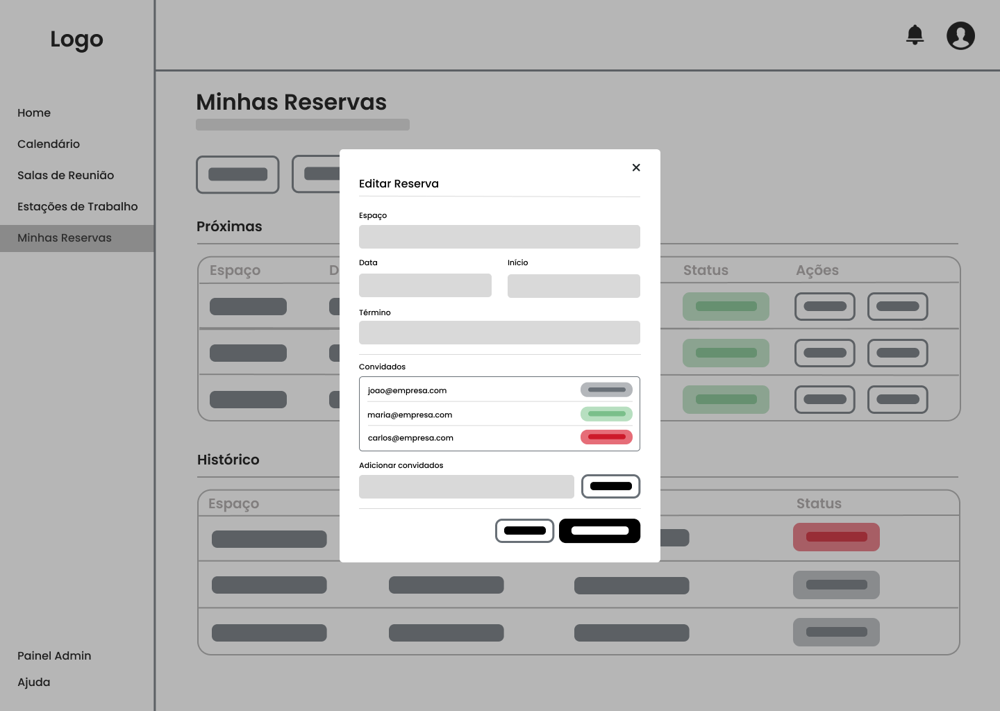

  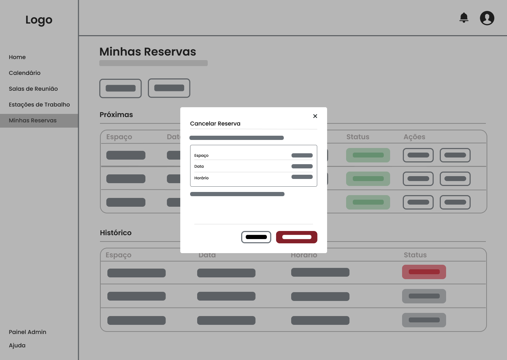

## Tela Painel Admin (Todas as Reservas)

A tela de todas as reservas apresenta uma visão geral dos agendamentos realizados no sistema, permitindo ao administrador visualizar, filtrar e controlar reservas.

Nesta tela, são apresentados os seguintes requisitos:
- RF-06: Visualizar, editar e cancelar todas as reservas
- RNF-02: Controle de acesso por perfil (administrador)

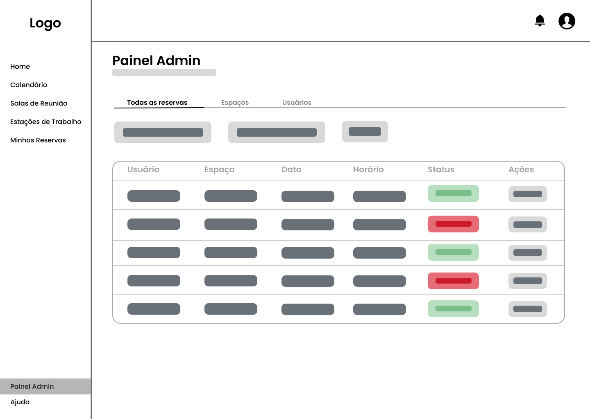

### Modal - Tela Painel Admin (Todas as Reservas)

O modal permite visualizar os detalhes da reserva selecionada e realizar ações como exclusão, garantindo maior controle administrativo e organização do sistema.

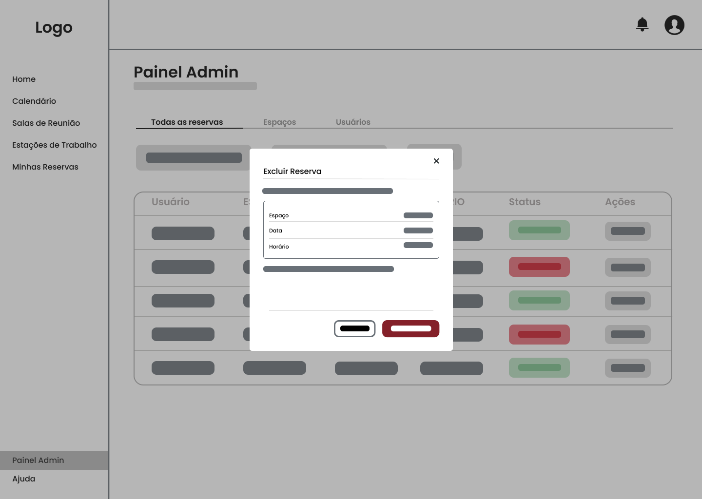

## Tela Painel Admin (Espaços)

A tela de espaços permite ao administrador visualizar, cadastrar e gerenciar salas de reunião e estações de trabalho.

Nesta tela, são apresentados os seguintes requisitos:
- RF-01: Cadastrar, editar, excluir e desativar espaços
- RNF-13: Código modular e facilidade de manutenção

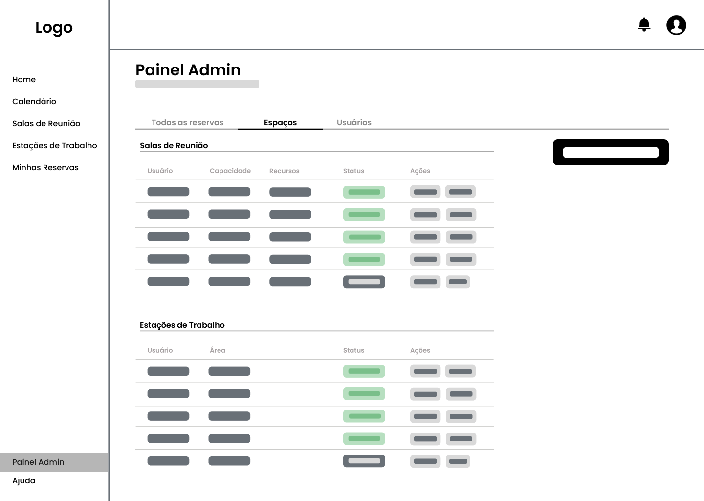

### Modais - Tela Painel Admin (Espaços)

Os modais permitem cadastrar novos espaços, editar informações existentes, ativar ou desativar ambientes e confirmar alterações realizadas, garantindo controle completo sobre os espaços.

  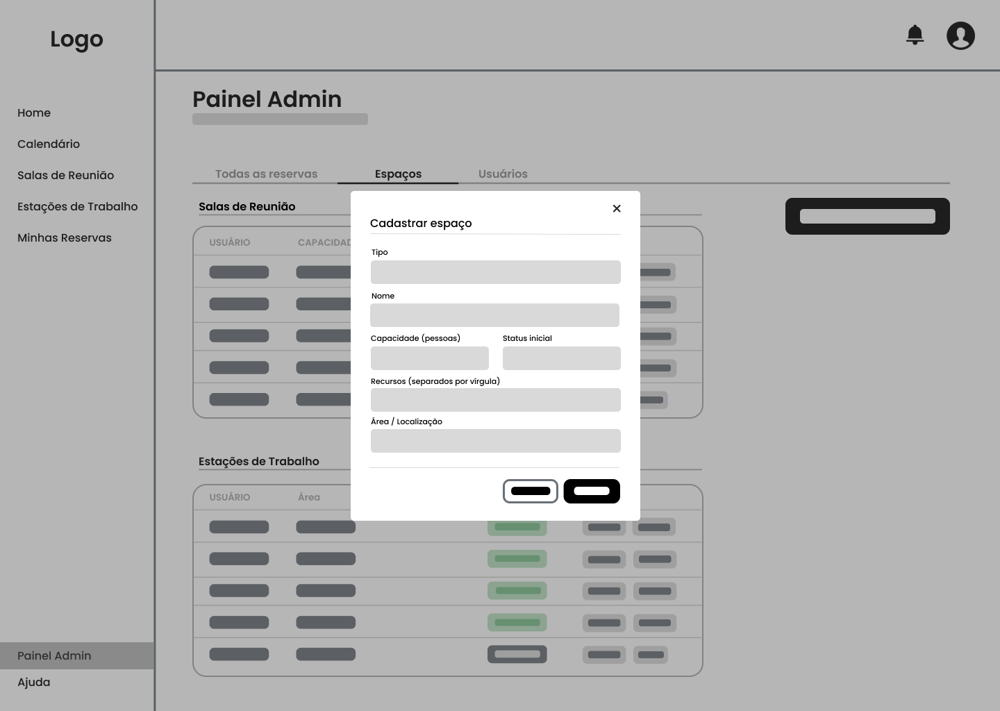
  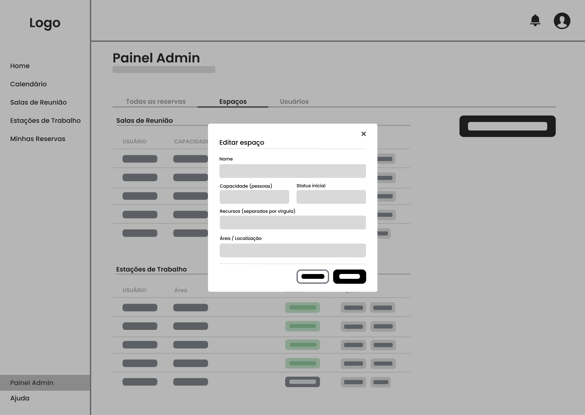

  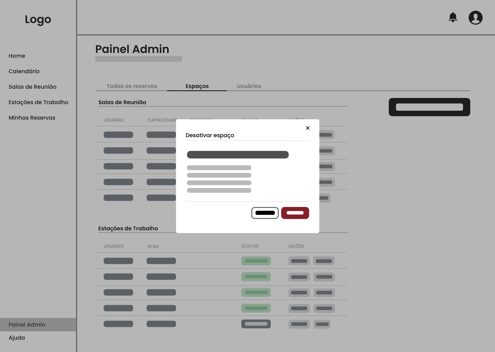
  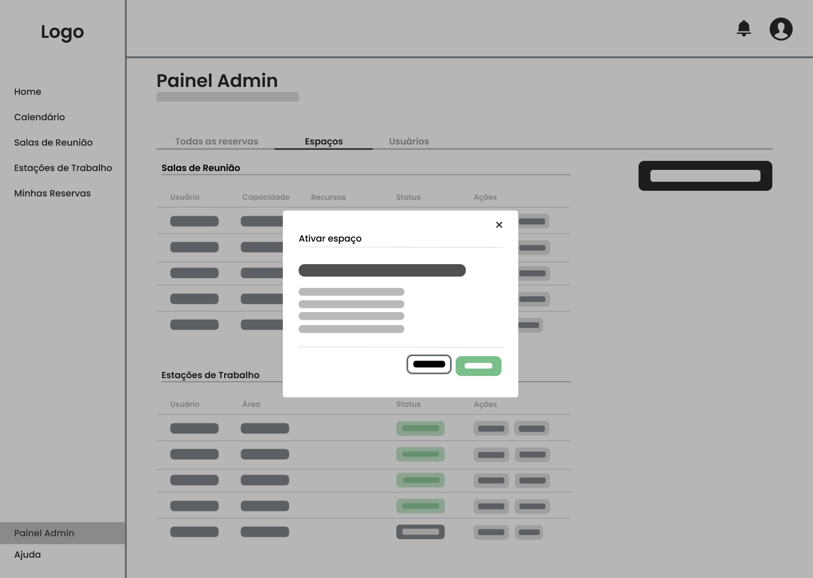

## Tela Painel Admin (Usuários)

A tela de usuários permite ao administrador visualizar e gerenciar os usuários do sistema.

Nesta tela, são apresentados os seguintes requisitos:
- RF-02: Cadastrar usuários
- RF-02: Remover usuários
- RNF-02: Controle de acesso por perfil

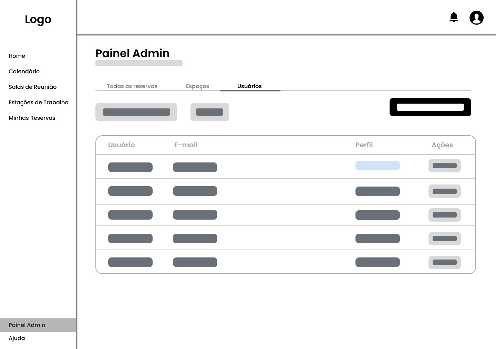

### Modais - Tela Painel Admin (Usuários)

Os modais permitem cadastrar novos usuários, definir seus níveis de acesso e confirmar a remoção, garantindo segurança no gerenciamento e controle de acesso ao sistema.

  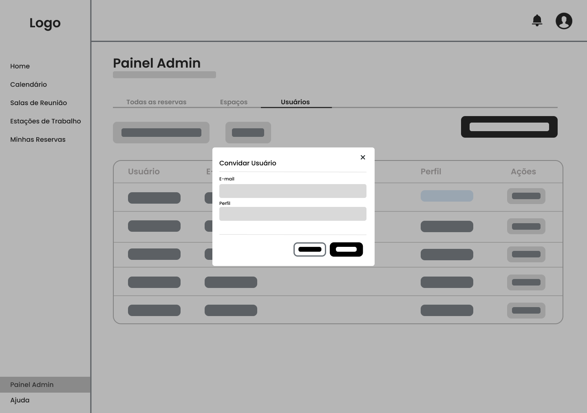
  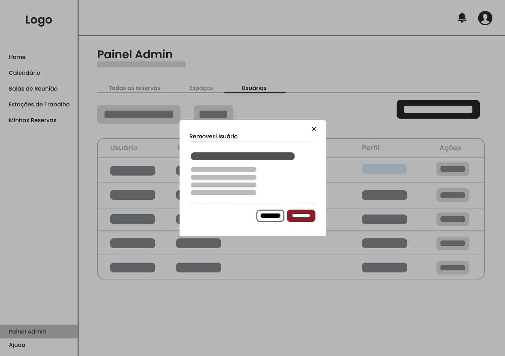

