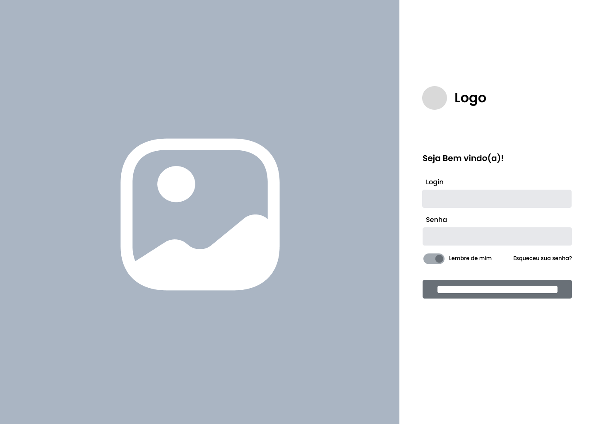
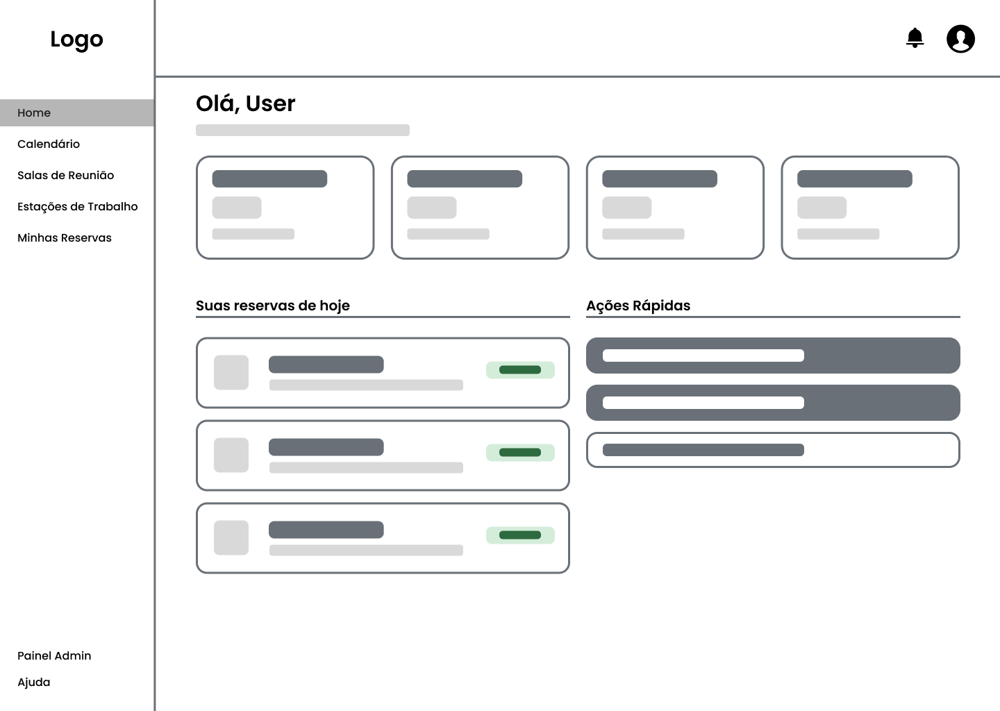
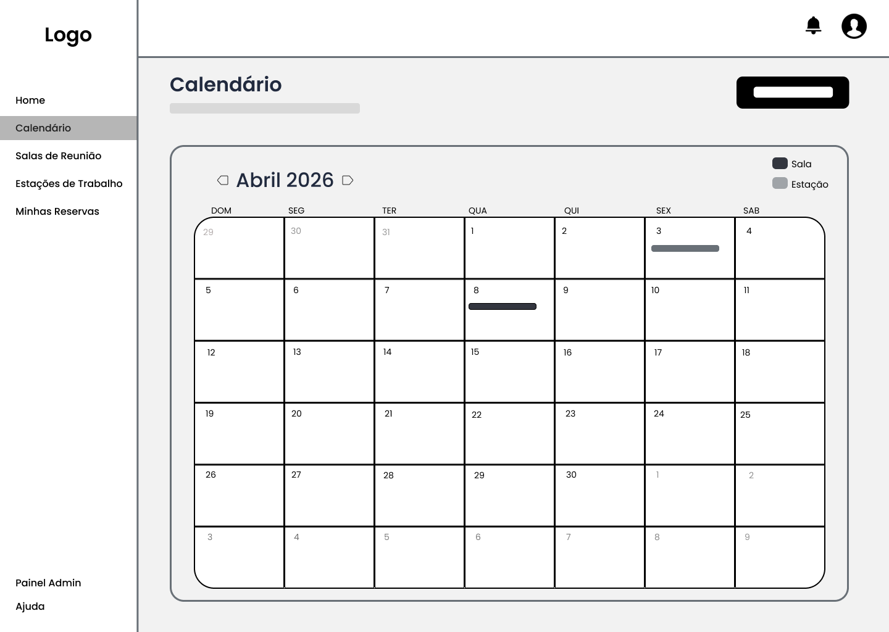
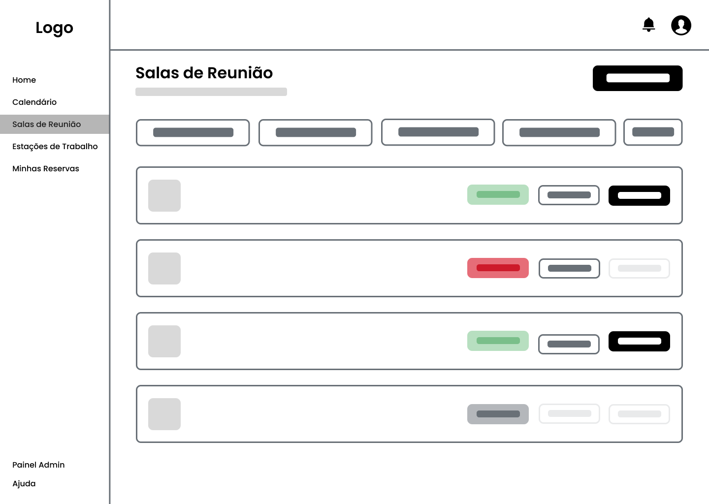
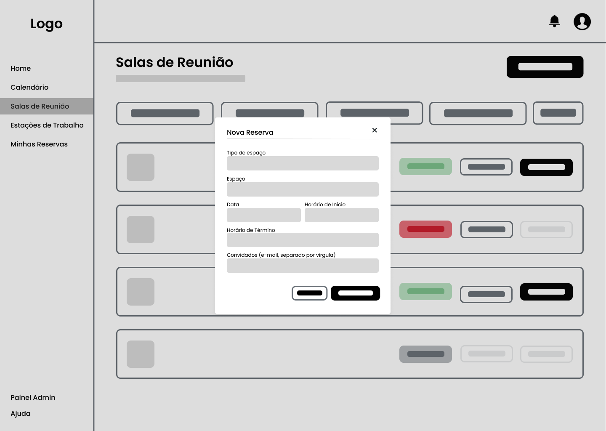
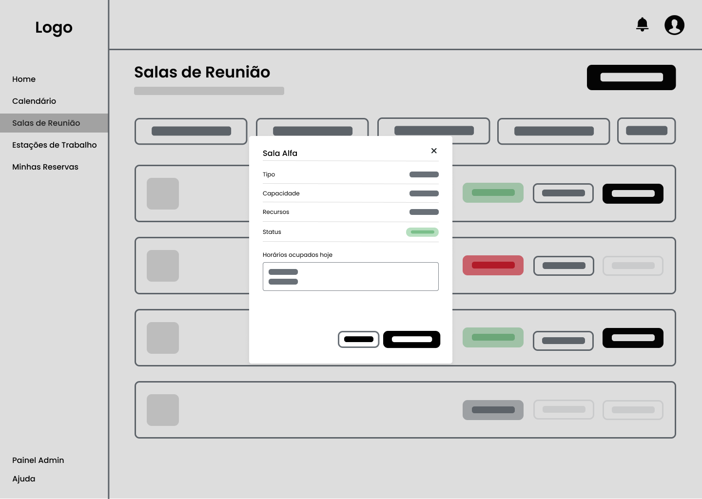
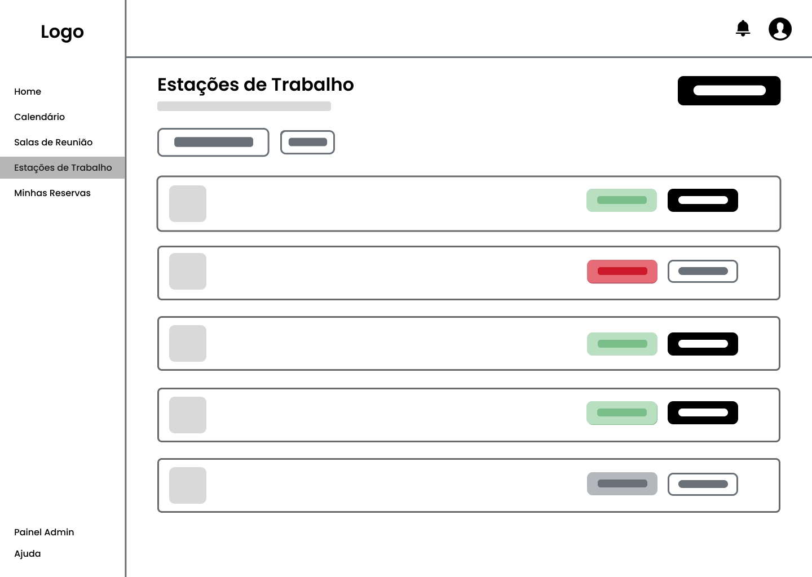
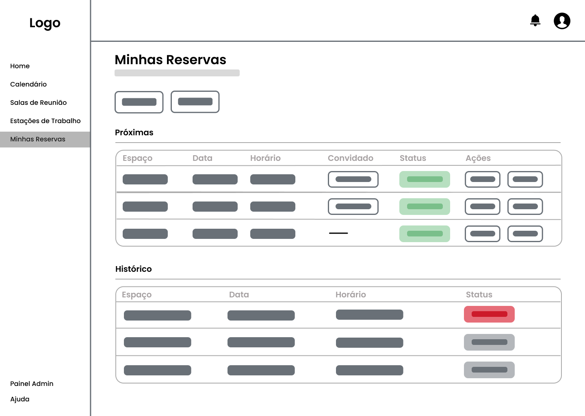

# Projeto de Interface

A interface do Deskly foi projetada com foco na organização e facilidade de uso, atendendo tanto colaboradores quanto administradores. A navegação permite que os usuários realizem tarefas como visualizar salas, fazer reservas e gerenciar convidados de forma ágil.

As telas foram desenvolvidas com base nas histórias de usuário, garantindo um fluxo eficiente para ações como o agendamento de salas. O sistema também é responsivo, apresenta bom desempenho e organiza as informações de forma clara, facilitando a tomada de decisão.

## User Flow

O fluxo de usuário do Deskly representa os caminhos desde o login até a execução das principais ações do sistema, como consultas, reservas e gerenciamento.

Após o acesso, o usuário navega entre as funcionalidades disponíveis de forma direta. Já os administradores possuem acessos adicionais para controle de salas, usuários e reservas. O fluxo foi estruturado para evitar etapas desnecessárias e tornar a navegação mais objetiva.

## Wireframes

Os wireframes do Deskly apresentam a estrutura das telas e a disposição dos elementos da interface, como menus, botões e campos de informação.

Eles foram utilizados para definir o layout e a relação entre as páginas, garantindo que cada funcionalidade do sistema esteja bem posicionada e alinhada aos requisitos do projeto.

## Tela de Login

(Resumo sobre a tela)

## Tela Inicial (Dashboard)

(Resumo sobre a tela)

## Tela de Calendário

(Resumo sobre a tela)

## Tela de Salas de Reunião

A tela de Salas de Reunião permite visualizar e filtrar os espaços disponíveis, mostrando informações como capacidade, recursos e status.

Nos modais, o usuário pode ver detalhes da sala, horários ocupados e realizar reservas, informando data, horário e convidados, com limite automático conforme a capacidade.

   

## Tela de Estações de Trabalho

(Resumo sobre a tela)

## Tela de Minhas Reservas

(Resumo sobre a tela)

## Tela de Painel Admin

(Resumo sobre a tela)

 

