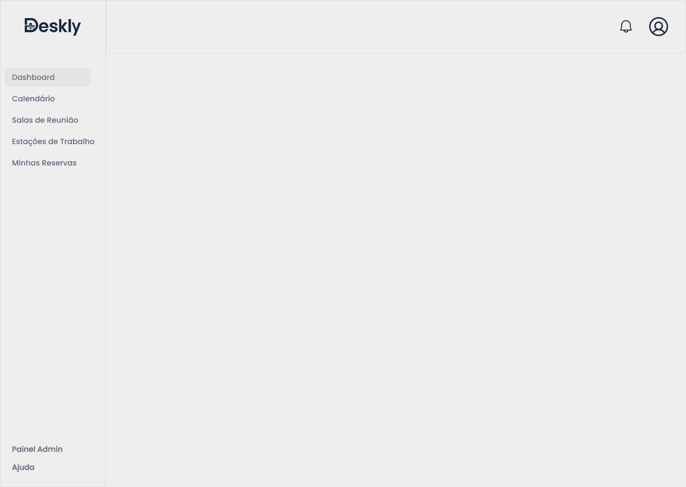

# Template padrão do site

O Deskly utiliza um layout padrão definido em HTML e CSS aplicado em todas as páginas, garantindo consistência visual, organização e facilidade de uso. A identidade visual foi construída com base em cores neutras, tipografia moderna e uso de ícones para facilitar a navegação.

---

## Design

O sistema segue um layout padrão composto por menu lateral fixo, barra superior e área central de conteúdo. O logotipo está posicionado no topo do menu lateral, permitindo fácil identificação do sistema.

A navegação foi estruturada para ser direta e intuitiva, com acesso rápido às funcionalidades principais como dashboard, calendário, salas, estações e reservas. Modais são utilizados para ações como criação, edição e exclusão, evitando mudança de tela.

<div style="background:#000; padding:20px; border-radius:10px; color:white;">
Layout Padrão - Deskly
<br><br>

</div>

---

## Cores

A paleta de cores foi definida para transmitir organização, clareza e profissionalismo, utilizando contrastes suaves para facilitar a leitura.

<div style="background:#000; padding:20px; border-radius:10px; color:white;">

<b>Primária</b>
<div style="display:flex; gap:15px; margin-top:10px;">
  <div style="text-align:center;">
    <div style="width:80px; height:30px; background:#394B67; border-radius:6px;"></div>
    <small>#394B67</small>
  </div>
</div>

<br>

<b>Textos</b>
<div style="display:flex; gap:15px;">
  <div style="text-align:center;">
    <div style="width:80px; height:30px; background:#212A3E; border-radius:6px;"></div>
    <small>#212A3E</small>
  </div>

  <div style="text-align:center;">
    <div style="width:80px; height:30px; background:#5E6679; border-radius:6px;"></div>
    <small>#5E6679</small>
  </div>
</div>

<br>

<b>Background</b>
<div style="display:flex; gap:15px;">
  <div style="text-align:center;">
    <div style="width:80px; height:30px; background:#EEEEEE; border-radius:6px;"></div>
    <small>#EEEEEE</small>
  </div>
</div>

<br>

<b>Status</b>
<div style="display:flex; gap:15px;">
  <div style="text-align:center;">
    <div style="width:80px; height:30px; background:#D4EDDA; border-radius:6px;"></div>
    <small>#D4EDDA</small>
  </div>

  <div style="text-align:center;">
    <div style="width:80px; height:30px; background:#F8D7DA; border-radius:6px;"></div>
    <small>#F8D7DA</small>
  </div>
</div>

</div>

---

## Tipografia

A tipografia utilizada no sistema é a **Poppins**, garantindo legibilidade e padronização visual.

<div style="background:#000; padding:20px; border-radius:10px; color:white;">

<p style="font-size:32px; font-weight:600;">Heading 1 – Título de página</p>
<p style="font-size:26px; font-weight:600;">Heading 2 – Título de seção</p>
<p style="font-size:20px; font-weight:600;">Heading 3 – Subtítulo</p>
<p style="font-size:16px; font-weight:500;">Heading 4 – Rótulos</p>
<p style="font-size:14px;">Texto padrão do sistema</p>
<p style="font-size:12px; color:#aaa;">Texto auxiliar</p>

</div>

A hierarquia tipográfica foi definida para facilitar a leitura e organização das informações na interface.

---

## Iconografia

Os ícones são utilizados para representar ações e facilitar a navegação do usuário no sistema.

<div style="background:#000; padding:20px; border-radius:10px; color:white;">

<div style="display:flex; gap:20px; align-items:center; flex-wrap:wrap;">

<div style="text-align:center;">
  <br>
  <small>Calendário</small>
</div>

<div style="text-align:center;">
  <br>
  <small>Notificações</small>
</div>

<div style="text-align:center;">
  <br>
  <small>Usuário</small>
</div>

<div style="text-align:center;">
  <br>
  <small>Criar</small>
</div>

<div style="text-align:center;">
  <br>
  <small>Editar</small>
</div>

<div style="text-align:center;">
  <br>
  <small>Excluir</small>
</div>

</div>

<p style="margin-top:10px; color:#aaa;">
Os ícones são utilizados na barra superior, filtros, botões de ação e listagens.
</p>

</div>

---

## Estilos CSS

Os estilos foram organizados com variáveis CSS para padronização e manutenção do sistema.

```css
:root {

    --color-btn-primary: #394B67;
    --color-heading: #212A3E;
    --color-text-md: #5E6679;
    --color-text-sm: rgba(94, 102, 121, 0.75);
    --color-border-card: rgba(94, 102, 121, 0.15);
    --color-background: #EEEEEE;
    --color-badge-green: #D4EDDA;
    --color-text-green: #2D6A3F;
    --color-text-red:#721C24;
    --color-btn-red: #F8D7DA;

    --main-font: "Poppins", sans-serif;

    --heading-1: 600 clamp(1.5rem, 2.5vw, 2rem)/1.25 var(--main-font);
    --heading-2: 600 clamp(1.25rem, 2vw, 1.75rem)/1.25 var(--main-font);
    --heading-3: 600 clamp(1rem, 1.5vw, 1.25rem)/1.25 var(--main-font);
    --heading-4: 500 clamp(0.875rem, 1.2vw, 1.125rem)/1.25 var(--main-font);
    --text-md: 500 clamp(0.875rem, 1vw, 1rem)/1 var(--main-font);
    --text-sm: 400 clamp(0.7rem, 0.8vw, 0.75rem)/1 var(--main-font);

    --spacing-xs: 0.5rem;
    --spacing-sm: 1rem;
    --spacing-md: 1.5rem;
    --spacing-lg: 2rem;
    --spacing-xl: 3rem;

    --radius-sm: 4px;
    --radius-md: 8px;
    --radius-lg: 16px;
}