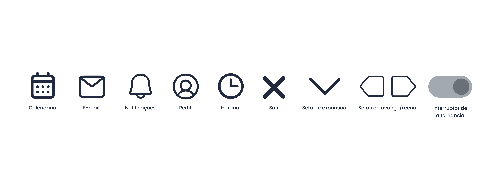

# Template padrão do site

O Deskly utiliza um layout padrão definido em HTML e CSS que é aplicado em todas as telas do sistema, garantindo consistência visual, organização e facilidade de uso.

A identidade visual foi construída com base em uma paleta de cores neutra e profissional, tipografia moderna e componentes reutilizáveis. O sistema também foi desenvolvido com foco em responsividade, permitindo uso em diferentes dispositivos.

---

## Design

O layout do sistema segue uma estrutura padrão composta por:

- **Menu lateral fixo (nav):** à esquerda com acesso às principais funcionalidades (Logo, Dashboard, Calendário, Salas, Estações, Reservas, Painel Admin e Ajuda);
- **Barra superior (header):** contendo informações do usuário e notificações;
- **Área central dinâmica (main):**, onde são exibidos os conteúdos principais de cada tela;

---

## Cores

A paleta de cores do sistema foi definida utilizando tons neutros e cores de apoio para indicar estados (sucesso, erro, ações).

### Cores principais

### Cores de status

## Tipografia

A tipografia utilizada no sistema é a **Poppins**, importada do Google Fonts, garantindo boa legibilidade e aparência moderna.

## Iconografia

O sistema utiliza ícones simples e intuitivos para facilitar a compreensão das ações pelo usuário. Os ícones são utilizados principalmente em botões e ações rápidas, reforçando a usabilidade e reduzindo a necessidade de leitura.

