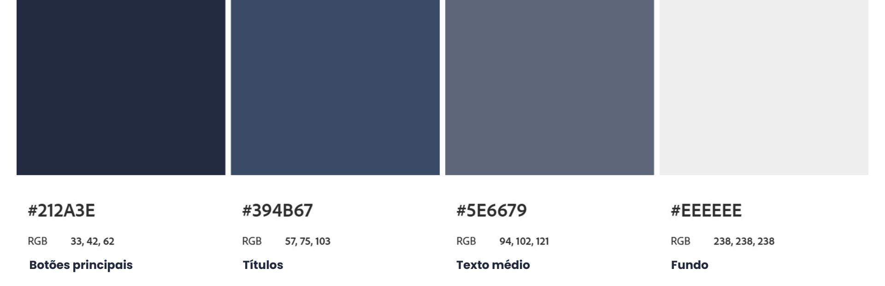
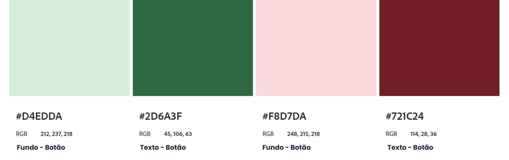

# Template padrão do site

O Deskly utiliza um layout padrão definido em HTML e CSS que é aplicado em todas as telas do sistema, garantindo consistência visual, organização e facilidade de uso.

A identidade visual foi construída com base em uma paleta de cores neutra e profissional, tipografia moderna e componentes reutilizáveis. O sistema também foi desenvolvido com foco em responsividade, permitindo uso em diferentes dispositivos.

---

## Design

O layout do sistema segue uma estrutura padrão composta por:

- **Menu lateral fixo (nav):** à esquerda com acesso às principais funcionalidades (Logo, Dashboard, Calendário, Salas, Estações, Reservas, Painel Admin e Ajuda);
- **Barra superior (header):** contendo informações do usuário e notificações;
- **Área central dinâmica (main):**, onde são exibidos os conteúdos principais de cada tela;

---

## Cores

A paleta de cores do sistema foi definida utilizando tons neutros e cores de apoio para indicar estados (sucesso, erro, ações).

### Cores principais

### Cores de status

## Tipografia

A tipografia utilizada no sistema é a **Poppins**, importada do Google Fonts, garantindo boa legibilidade e aparência moderna.

## Iconografia

Defina os ícones que serão utilizados e suas respectivas funções.

Apresente os estilos CSS criados para cada um dos elementos apresentados.
Outras seções podem ser adicionadas neste documento para apresentar padrões de componentes, de menus, etc.

> **Links Úteis**:
>
> -  [Como criar um guia de estilo de design da Web](https://edrodrigues.com.br/blog/como-criar-um-guia-de-estilo-de-design-da-web/#)
> - [CSS Website Layout (W3Schools)](https://www.w3schools.com/css/css_website_layout.asp)
> - [Website Page Layouts](http://www.cellbiol.com/bioinformatics_web_development/chapter-3-your-first-web-page-learning-html-and-css/website-page-layouts/)
> - [Perfect Liquid Layout](https://matthewjamestaylor.com/perfect-liquid-layouts)
> - [How and Why Icons Improve Your Web Design](https://usabilla.com/blog/how-and-why-icons-improve-you-web-design/)
